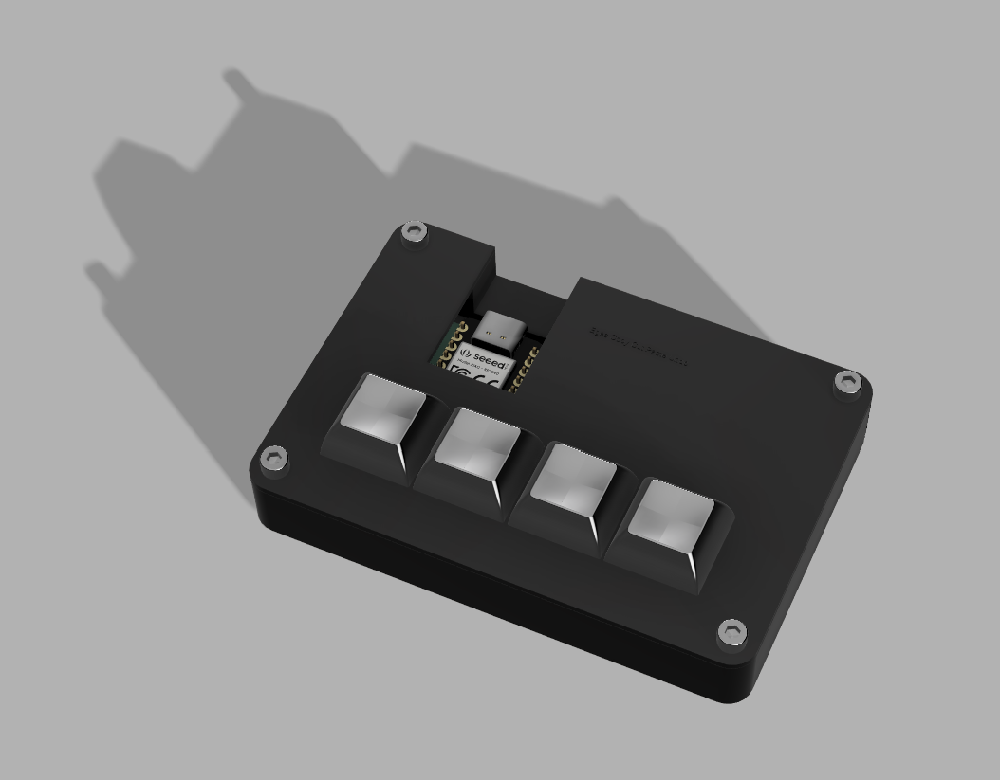
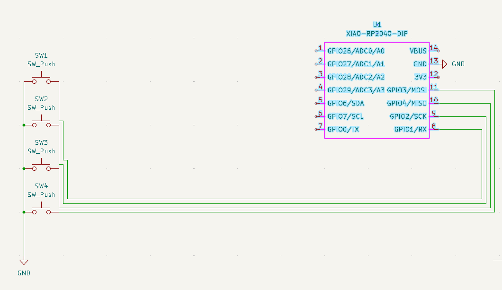
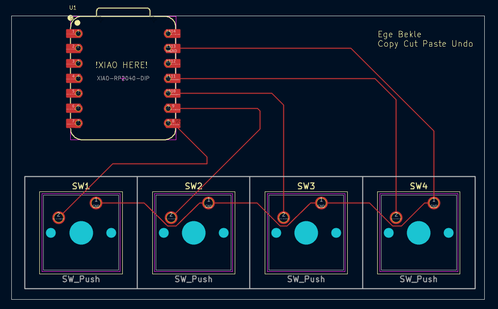
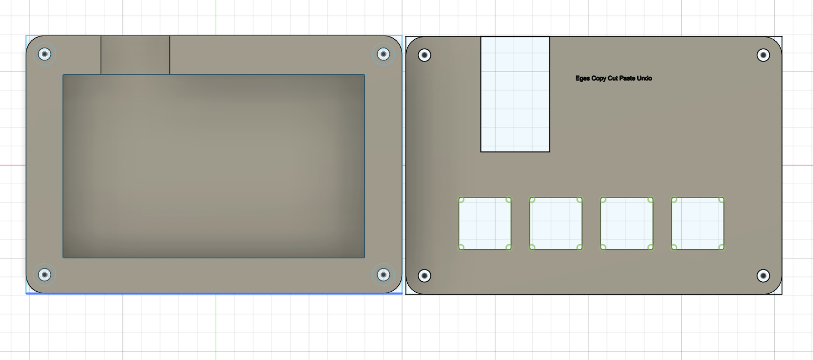

# Copy Cut Paste Undo
Copy Cut Paste Undo is a macropad made for making copying, cutting, pasting and undoing easier and faster by reducing the amount of keys you have to press.

# Specs
### BOM:

4x Cherry MX Switches\
1x XIAO RP2040\
4x Blank DSA Keycaps\
4x M3x16 Bolt\
4x M3 Heatset

### Others:
KMK Firmware\
Top Case.stl\
Bottom Case.stl

# Schematic

# PCB

# Case

